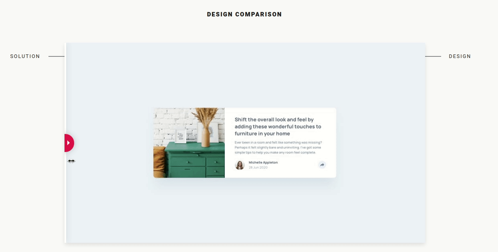

# Frontend Mentor - Article preview component solution

This is a solution to the [Article preview component challenge on Frontend Mentor](https://www.frontendmentor.io/challenges/article-preview-component-dYBN_pYFT). Frontend Mentor challenges help you improve your coding skills by building realistic projects.

## Table of contents

- [Overview](#overview)
  - [The challenge](#the-challenge)
  - [Screenshot](#screenshot)
  - [Links](#links)
- [My process](#my-process)
  - [Built with](#built-with)
  - [What I learned](#what-i-learned)
  - [Useful resources](#useful-resources)
- [Author](#author)

## Overview

This is the front-end mentor's fourteen challenge. The challenge is to build the "Article preview component" and make it as close to the design as possible. Building the desing with whatever you want to finish, any language, framework or tools.

### The challenge

Users should be able to:

- View the optimal layout for the component depending on their device's screen size
- See the social media share links when they click the share icon

## Screenshot

### Mobile design

<p  align="center">
  </img>
</p>

### Tablets design

<p  align="center"></img></p>

### Desktop design

<p  align="center"></img></p>

### result of my work

<p  align="center"></img></p>

### Links

- Solution URL: [My solution for this challenge](https://www.frontendmentor.io/solutions/article-preview-component-with-reactjs-and-styledcomponents-Fq1KBDtX9)
- Live Site URL: [check the result](https://jcdmeira-article-preview.netlify.app)

- My figma design: [Figma](https://www.figma.com/file/VzQNdjazNfq7zSiXo1hxVE/14-article-preview?node-id=0%3A1)

## My process

### Built with

- Mobile-first workflow
- [React](https://reactjs.org/) - JS library
- [Styled components](https://styled-components.com) - CSS in js with stiled components

### What I learned

it is possible to make a modal appear according to the use of a state.

```JS
export const Card = styled.div`
.modal-none{
    display: ${(props) => (props.isOpen === false ? 'flex' : 'none')};
  }
  .modal{
    position: absolute;
    display: ${(props) => (props.isOpen === true ? 'flex' : 'none')};
  }
  `;
```

### Useful resources

- [react tutorial](https://pt-br.reactjs.org/tutorial/tutorial.html) - This helped me structure the components and build the proposed page.
- [my figma design](https://www.figma.com/file/VzQNdjazNfq7zSiXo1hxVE/14-article-preview?node-id=0%3A1) - My figma design for help anyone who wants to build this challenge.
- [CSS units conversor - px to VH/VW/REM](https://it-news.pw/pxtovh/) - CSS units conversor .
- [Converting Colors](https://convertingcolors.com) - HSL for all color systems.

## Author

- Personal Page - [Jean Carlos De Meira](https://jcdmeira.github.io)
- Frontend Mentor - [@JCDMeira](https://www.frontendmentor.io/profile/JCDMeira)
- Instagram - [@jean.meira10](https://www.instagram.com/jean.meira10/)
- GitHub - [JCDMeira](https://github.com/JCDMeira)
